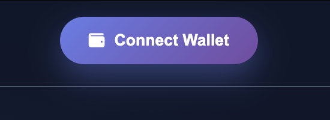
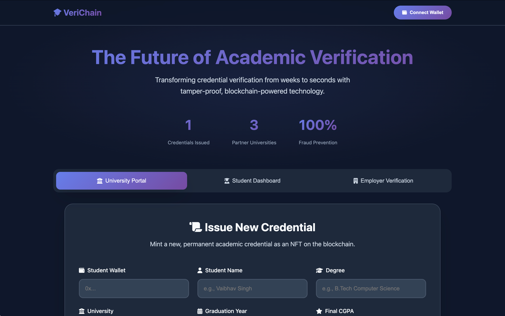
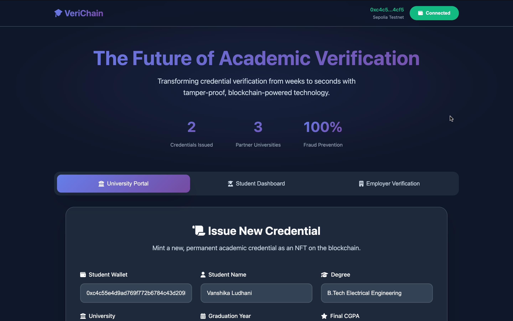
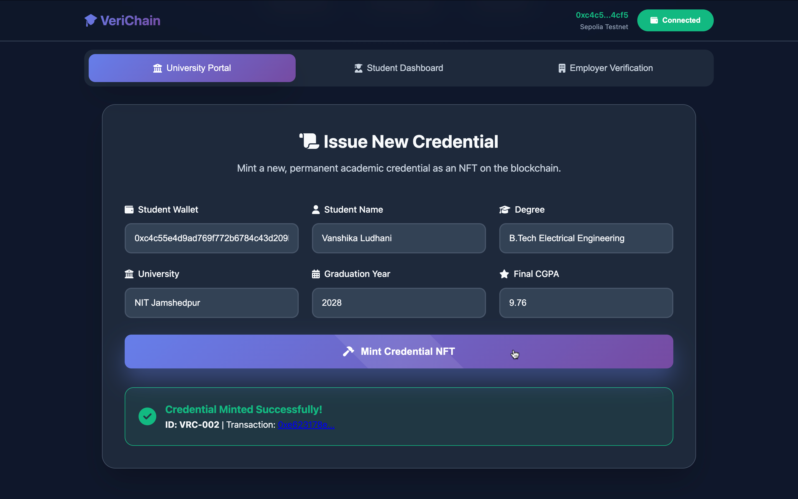
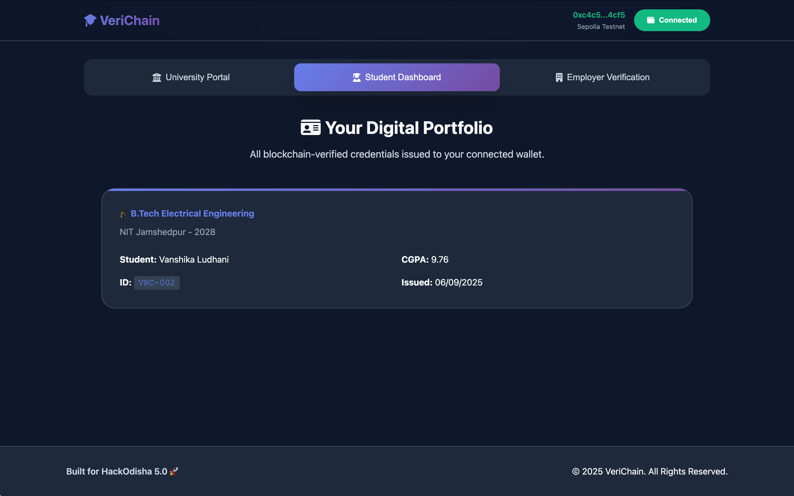
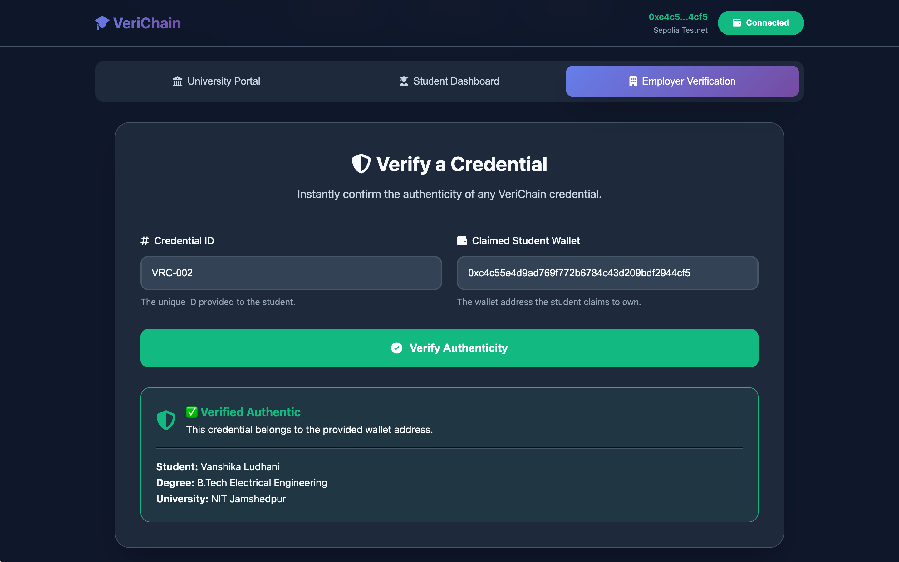

# 🎓 VeriChain
### Blockchain-Powered Academic Credential Verification System

[](https://verichain.netlify.app/)
[](https://hackodisha.com)
[](https://ethereum.org)
[](LICENSE)

> **Transforming academic verification from 3 weeks to 3 seconds with blockchain technology**

---

## 💡 The Problem We Solve

Traditional academic credential verification is slow, expensive, and prone to fraud.
- **$600M** is lost annually to fake academic credentials.
- The average verification time is **2-3 weeks**.
- **84%** of employers have encountered resume fraud.
- There is **no global standard** for credential verification, creating friction for students and employers worldwide.

---

## ✨ Our Solution

**VeriChain** is a decentralized platform that creates tamper-proof, instantly verifiable digital academic credentials using blockchain technology.

### 🏛️ **For Universities**
- Issue permanent, blockchain-verified credentials in seconds.
- Eliminate fraud and protect institutional reputation.
- Utilize a simple, intuitive interface designed for university staff.

### 🎓 **For Students**
- Gain true ownership of your academic achievements as NFTs in your personal crypto wallet.
- Share your verified credentials instantly and securely with employers around the globe.
- Your achievements cannot be altered or revoked by any central authority.

### 💼 **For Employers**
- Verify any candidate's credentials in under 3 seconds with cryptographic certainty.
- Achieve 100% fraud prevention, ensuring you hire qualified candidates.
- Integrate with existing HR systems seamlessly via our RESTful API.

---

## 🚀 Quick Start

### **Option 1: Frontend Only (Recommended for Demo)**
This method runs a lightweight, simulated version of the application directly in your browser without needing the backend.

```bash
# Navigate to the frontend directory
cd frontend

# Open the index.html file in your browser
open index.html

# Or, serve it locally using Python
python3 -m http.server 8000

```

### **Option 2: Full Stack**
This method runs both the frontend and the Python Flask backend server.

1.  **Backend Setup (Terminal 1)**
    ```bash
    cd backend
    pip3 install -r requirements.txt
    python3 app.py
    ```
    The API server will be running at `http://localhost:5000`.

2.  **Frontend Setup (Terminal 2)**
    ```bash
    cd frontend  
    python3 -m http.server 8000
    ```
    The frontend will be running at `http://localhost:8000`.

---

## 🛠️ Technology Stack

| Component | Technology | Description |
| :--- | :--- | :--- |
| **Frontend** | HTML5, CSS3, Vanilla JavaScript | A modern, responsive, and lightweight user interface with no framework dependencies. It includes a realistic Web3 simulation for demo purposes.  |
| **Backend** | Python, Flask, Flask-CORS | A robust RESTful API server to manage credential issuance, verification, and system analytics. |
| **Blockchain** | Ethereum (Sepolia Testnet) | Credentials are designed to be minted as ERC-721 standard NFTs on an Ethereum-compatible network. The backend simulates interactions with the Sepolia Testnet. |
| **Wallet** | MetaMask Integration | The application interfaces with the industry-standard MetaMask wallet for user authentication and credential ownership.  |

---

## 🎮 Demo Walkthrough

1. **Connect Wallet**  
   - Click the **Connect Wallet** button to simulate a MetaMask connection.  
   - A unique demo wallet address will be generated and displayed on the top-right corner.  
   - Before connection, the button shows *“Connect Wallet”*. After connection, it shows *“Connected”* with the wallet address.  

   **Screenshots:**  
   - Connect Wallet Button  
       

   - Before Connecting  
       

   - After Connecting  
       

2. **University Issues a Credential**  
   - Navigate to the **University Portal** tab.  
   - Fill in the student’s details (wallet address, name, degree, etc.).  
   - Click *“Mint Credential NFT”*. A new, permanent credential is simulated on the blockchain.  
     

3. **Student Views Their Portfolio**  
   - Switch to the **Student Dashboard** tab.  
   - If your wallet is connected, you will see all credentials that have been issued to your address.  
     

4. **Employer Verifies Instantly**  
   - Go to the **Employer Verification** tab.  
   - Enter the `Credential ID` and the `Claimed Student Wallet` address.  
   - Click *“Verify Authenticity”* to get instant, cryptographic proof of the credential’s validity and ownership.  
     

---

## 🔧 API Documentation

The backend provides a full RESTful API for integration.

**Base URL:** `http://localhost:5000/api`

| Method | Endpoint | Description |
| :--- | :--- | :--- |
| `POST` | `/credentials/issue` | Mints a new academic credential. |
| `POST` | `/credentials/verify` | Verifies the authenticity and ownership of a credential. |
| `GET` | `/credentials/<wallet_address>` | Retrieves all credentials owned by a specific wallet. |
| `GET` | `/stats` | Returns comprehensive statistics for the entire system. |
| `GET` | `/universities` | Lists all partner universities on the platform. |

#### **Example: Issue Credential**
`POST /api/credentials/issue`
```json
{
    "student_wallet": "0x742d35Cc6635Cc6634C0532925a3b8D8c8d02EbE92E632",
    "student_name": "Vaibhav Singh", 
    "degree": "B.Tech Computer Science",
    "university": "NIT Rourkela",
    "year": "2026",
    "cgpa": "8.7"
}
```
---

## **🌟 Key Features**

* **Blockchain Credential Issuance**: Universities can mint tamper-proof NFT credentials using the University Portal.  
* **Instant Verification**: Employers can verify credentials in seconds through the verification portal.  
* **Wallet-Based Ownership**: Students have full control over their academic records, which are linked directly to their personal wallet address.  
* **Student Portfolio**: A clean dashboard allows students to view all credentials that have been issued to their connected wallet.  
* **Fraud Prevention**: Cryptographic proof eliminates forgery. The backend includes logic to detect ownership mismatches and flag potential fraud.  
* **Analytics Dashboard**: The backend provides real-time metrics on system usage, verifications, and security.  
* **Responsive UI**: The application features a modern and accessible interface that works across all devices.

## **🤝 Team**

* **Vanshika Ludhani** \- Backend Development, Business Strategy
* **Vaibhav Singh** \- Frontend Development, Technical Architecture  


<div align="center">

*Transforming Academic Verification, One Credential at a Time*

---

</div>

<div align="center">

[](https://github.com/singhvaibhav-ai/HackOdisha5.0-VeriChain)
&nbsp;&nbsp;
[](https://www.linkedin.com/in/vaibhav-singh-553a49318/)
&nbsp;&nbsp;
[](https://www.linkedin.com/in/vanshika-ludhani-1a7a5a1a5/)

---

Built with ❤️ by Vaibhav Singh & Vanshika Ludhani for **HackOdisha 5.0**

</div>